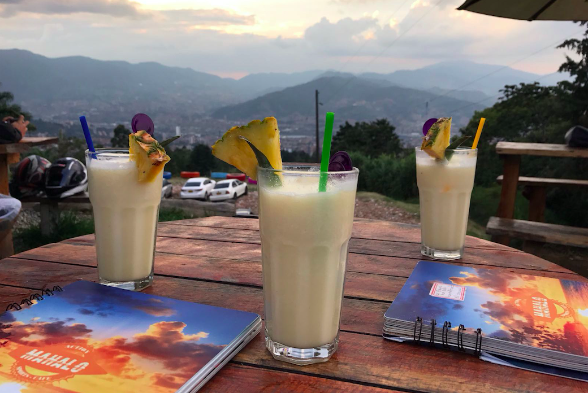
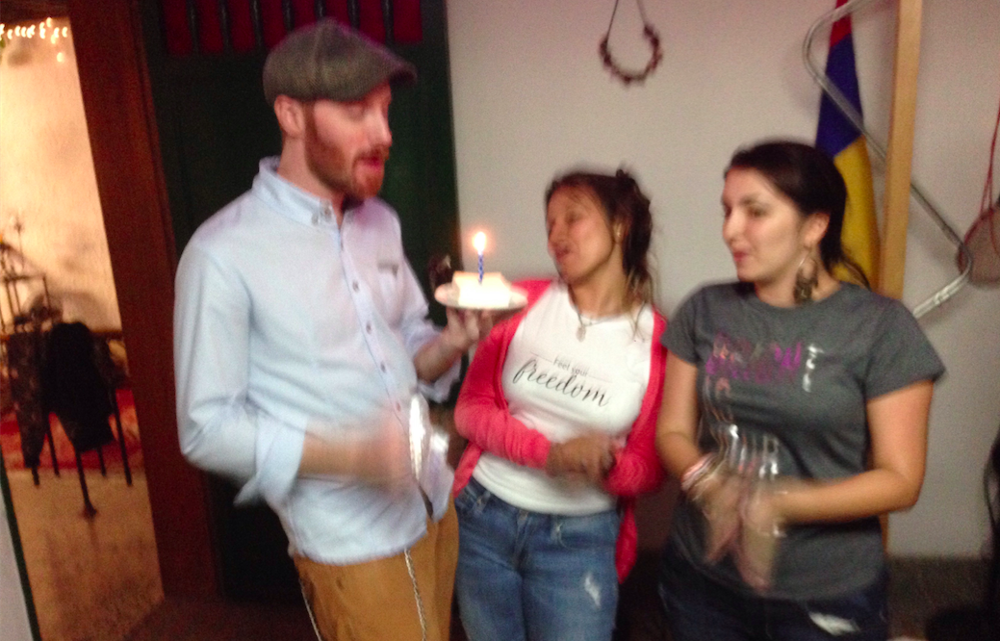
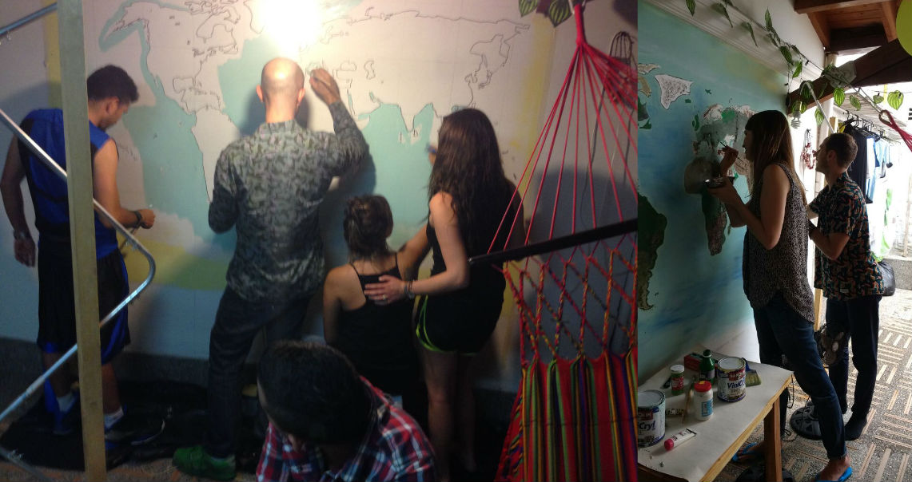
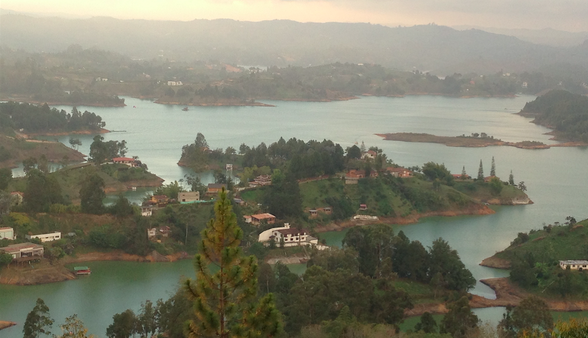
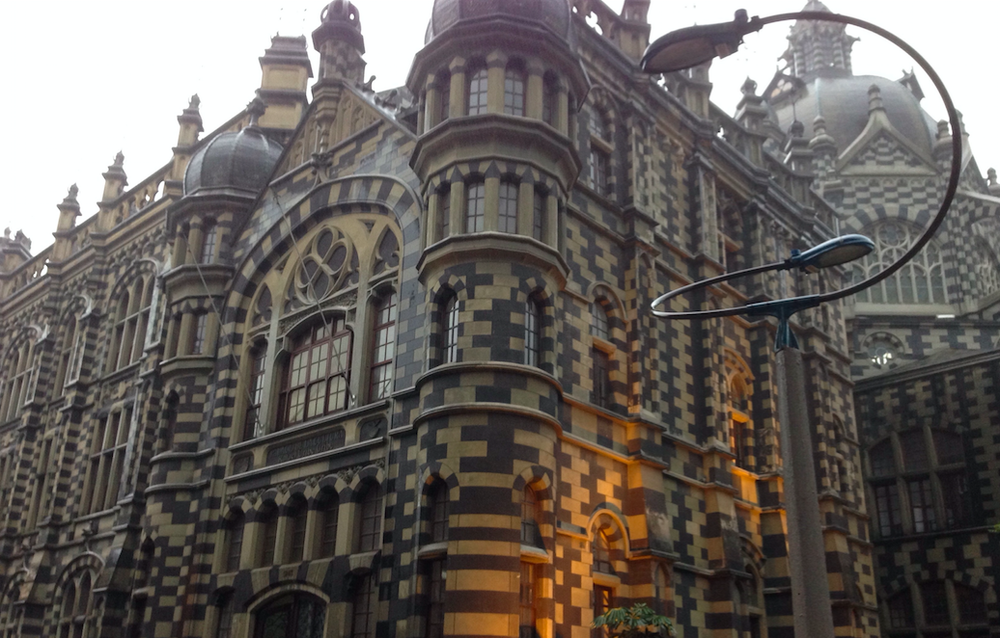
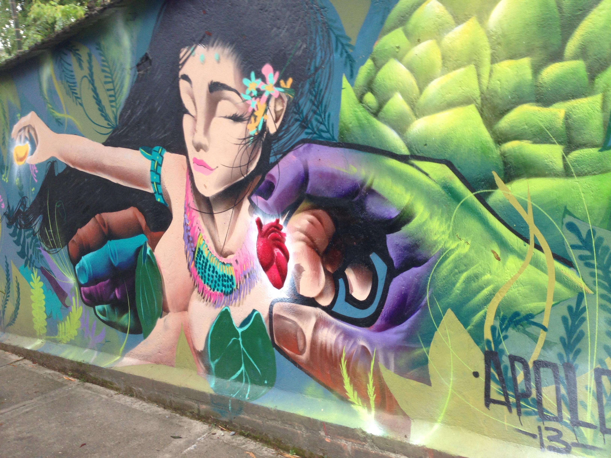
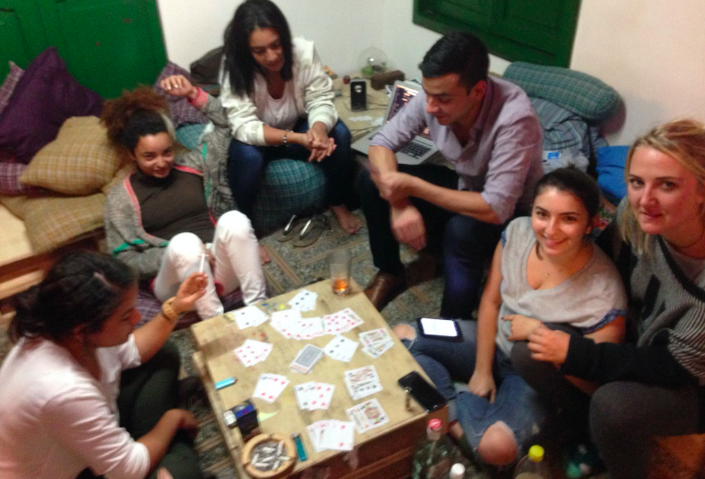
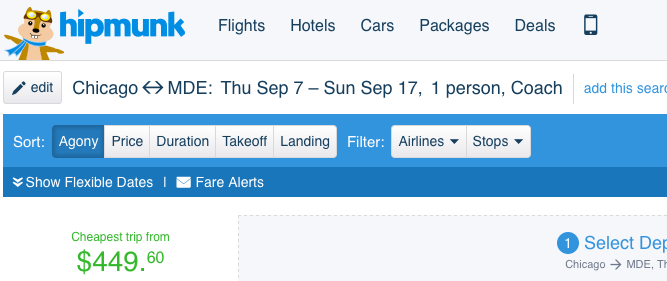
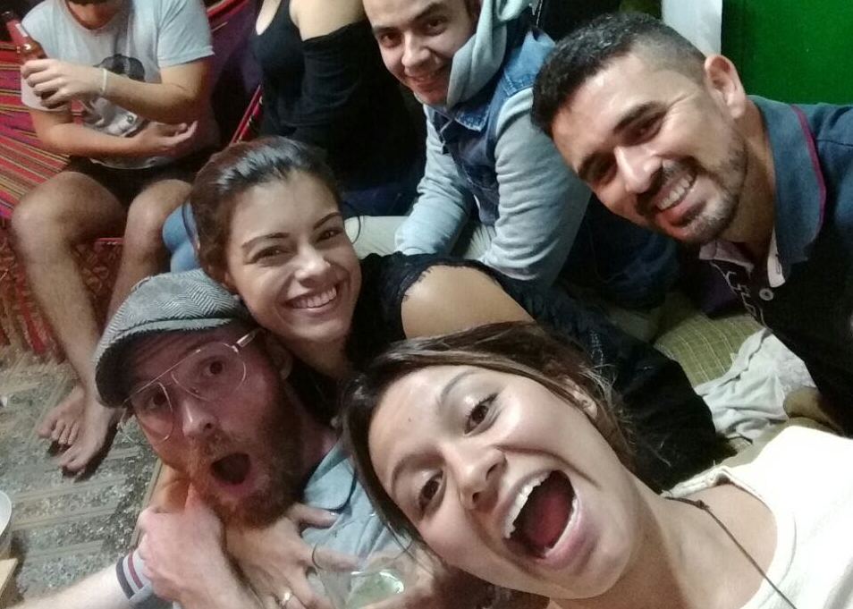

Lets go to Colombia!
====================

I just rented this house in Medellín Colombia for 7-17 September.
The first 5 people that give me money have a room reserved,
you can do the whole thing for about a grand, money details are at the bottom.
Here's a video of the house.

<iframe src="https://player.vimeo.com/video/215443045" width="640" height="360" frameborder="0" webkitallowfullscreen mozallowfullscreen allowfullscreen></iframe>

Our hosts are wonderful, they threw me two birthday parties when I stayed with them!

We all got together and painted a mural on their wall! We decided it should only ever asymptotically approach finished, this way there is always a reason to invite people over for more painting ^^

It's a bus ride away from the Amazon rain forest and Guatape (pictured below).

There are some great tours through downtown Medellín!

The street art is amazing!

The neighbours like to come over for games

We could rent a place in the mountains

The humans are welcoming and wonderful!

---

Our house has 6 rooms total, one is mine, so that leaves 5 spots open. Rooms are $250 each, for the whole 10 days ($25/night, half that if you bring a loved one). One room has its own bathroom, that one is $500 instead of $250, lets save it for whoever really cares about that sort of thing. The first 5 to get me $$ will have a spot reserved.

If your work pays for conferences, there is a [Ruby Conf](http://www.rubyconf.co/) on Sept 8 and 9, tickets are $90, you might be able to get the whole thing paid for by your work!

Round trip plane tickets can be bought for under $500!

So the whole thing can be done for < $1000 (cost of living there is about a third what it is here).

---

The people are welcoming and wonderful, lets go to Medellín!

